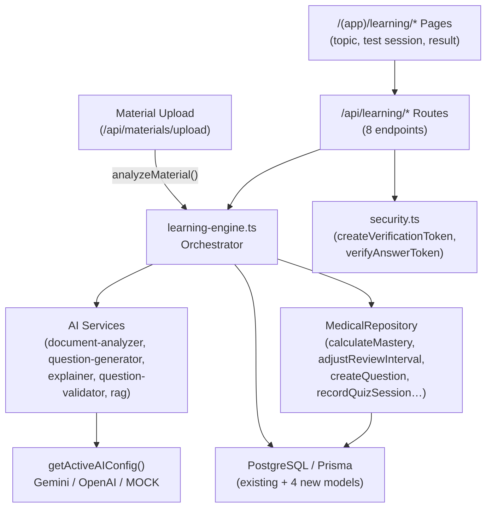

# Design Document: AI Learning Engine

## Overview

The AI Learning Engine is a full-cycle adaptive study system layered on top of the existing Saida Med AI infrastructure. It takes a student from material upload through deep AI analysis, structured subtopic extraction, personalized question generation, persistent test sessions, result analysis, weak-spot detection, and spaced-repetition scheduling — all without replacing any existing route, page, or model.

The engine is implemented as a single orchestration module (`src/lib/ai/learning-engine.ts`) that delegates to existing AI services, the existing repository, and new Prisma models. All new API routes live under `/api/learning/` and all new pages under `/(app)/learning/`.

**Key design decisions:**

- Pure arithmetic functions (`calculateQuestionPlan`, `calculateWeakSpots`, `analyzeTestResult`, `updateMastery`) make no AI calls — they are fully deterministic and unit-testable.
- All AI calls go through `getActiveAIConfig()` — the API key is never read directly from `process.env`.
- Answer tokens use the existing AES-256-GCM `createVerificationToken` / `verifyAnswerToken` — correct answers never appear in browser state.
- Explanation results are cached in a new `explanationCache` field on `Topic` (or in-memory on the server) — repeated calls to `generateExplanation` for the same entity never re-hit the AI.
- The largest-remainder method is used everywhere proportional integer allocation is required.

---

## Architecture



### Data flow for a complete study cycle

```
Upload → analyzeMaterial() → extractSubtopics() → extractConcepts()
       → [persisted to Topic / Subtopic / Concept / KeyFact]

Student clicks "Полный тест"
  → calculateQuestionPlan() [deterministic]
  → generateQuestions() → QuestionValidator → createQuestion()
  → POST /api/learning/sessions  → TestSession (IN_PROGRESS)

Per answer:
  → POST /api/learning/sessions/[id]/answers
  → verifyAnswerToken() → TestAnswer persisted in transaction
  → answeredCount++

Last answer:
  → status = COMPLETED
  → analyzeTestResult() [deterministic]
  → calculateWeakSpots() [deterministic] → WeakSpotRecord upserts
  → updateMastery() → TopicPerformance upsert
  → adjustReviewInterval() → nextReviewAt updated
  → ResultAnalysis returned in same response
```

---

## Data Models

### New Prisma models (additions to `prisma/schema.prisma`)

```prisma
enum TestSessionMode {
  FULL
  FOCUS
  ADAPTIVE
}

enum TestSessionStatus {
  IN_PROGRESS
  COMPLETED
  ABANDONED
}

model Subtopic {
  id             String    @id @default(cuid())
  topicId        String
  topic          Topic     @relation(fields: [topicId], references: [id], onDelete: Cascade)
  name           String    @db.VarChar(200)
  description    String?   @db.VarChar(1000)
  pageStart      Int?
  pageEnd        Int?
  contentDensity Float     @default(0.5)       // inclusive [0, 1]
  orderIndex     Int       @default(0)
  createdAt      DateTime  @default(now())

  concepts       Concept[]
  testAnswers    TestAnswer[]
  weakSpots      WeakSpotRecord[]

  @@index([topicId])
}

model TestSession {
  id              String            @id @default(cuid())
  userId          String
  user            User              @relation(fields: [userId], references: [id], onDelete: Cascade)
  topicId         String
  topic           Topic             @relation(fields: [topicId], references: [id], onDelete: Cascade)
  subtopicIds     Json                         // String[] — snapshot of included subtopicIds
  mode            TestSessionMode
  questionPlan    Json                         // QuestionPlan snapshot
  totalQuestions  Int
  answeredCount   Int               @default(0)
  status          TestSessionStatus @default(IN_PROGRESS)
  startedAt       DateTime          @default(now())
  completedAt     DateTime?
  score           Int?
  accuracyPct     Float?

  answers         TestAnswer[]

  @@index([userId, topicId, status])
}

model TestAnswer {
  id               String      @id @default(cuid())
  sessionId        String
  session          TestSession @relation(fields: [sessionId], references: [id], onDelete: Cascade)
  questionId       String
  question         Question    @relation(fields: [questionId], references: [id], onDelete: Cascade)
  subtopicId       String?
  subtopic         Subtopic?   @relation(fields: [subtopicId], references: [id], onDelete: SetNull)
  conceptId        String?
  concept          Concept?    @relation(fields: [conceptId], references: [id], onDelete: SetNull)
  selectedOptionId String
  isCorrect        Boolean
  responseTimeMs   Int
  answeredAt       DateTime    @default(now())

  @@unique([sessionId, questionId])
  @@index([sessionId])
  @@index([subtopicId, conceptId])
}

model WeakSpotRecord {
  id             String    @id @default(cuid())
  userId         String
  user           User      @relation(fields: [userId], references: [id], onDelete: Cascade)
  topicId        String
  topic          Topic     @relation(fields: [topicId], references: [id], onDelete: Cascade)
  subtopicId     String?
  subtopic       Subtopic? @relation(fields: [subtopicId], references: [id], onDelete: SetNull)
  conceptId      String?
  concept        Concept?  @relation(fields: [conceptId], references: [id], onDelete: SetNull)
  classification String    // "weak" | "needs_review" | "developing" | "strong" | "insufficient_data"
  accuracyPct    Float
  evidenceCount  Int
  lastUpdatedAt  DateTime  @updatedAt

  @@unique([userId, topicId, subtopicId, conceptId])
  @@index([userId, topicId])
}
```

#### Existing model additions

```prisma
// Add to Topic model:
subtopics  Subtopic[]
testSessions TestSession[]
weakSpots  WeakSpotRecord[]

// Add to Concept model:
subtopicId String?
subtopic   Subtopic? @relation(fields: [subtopicId], references: [id], onDelete: SetNull)
testAnswers TestAnswer[]
weakSpots  WeakSpotRecord[]

// Add to Question model:
testAnswers TestAnswer[]

// Add to User model:
testSessions TestSession[]
weakSpots   WeakSpotRecord[]
```

---

## New Zod Schemas (additions to `src/lib/ai/schemas.ts`)

```typescript
// Subtopic extraction result from AI
export const SubtopicSchema = z.object({
  name: z.string().max(200),
  description: z.string().max(1000).optional(),
  pageStart: z.number().int().min(1).optional(),
  pageEnd: z.number().int().min(1).optional(),
  contentDensity: z.number().min(0).max(1).default(0.5),
  orderIndex: z.number().int().min(0).default(0),
});

export const SubtopicExtractionSchema = z.object({
  subtopics: z.array(SubtopicSchema),
});

// Question plan allocation per subtopic
export const SubtopicAllocationSchema = z.object({
  subtopicId: z.string(),
  subtopicName: z.string(),
  count: z.number().int().min(1),
  concepts: z.array(z.string()),     // concept names for generation context
  difficulty: z.object({
    easy: z.number().int().min(0),
    medium: z.number().int().min(0),
    hard: z.number().int().min(0),
  }),
});

export const QuestionPlanSchema = z.object({
  totalCount: z.number().int().min(1),
  mode: z.enum(["FULL", "FOCUS"]),
  subtopics: z.array(SubtopicAllocationSchema),
  difficultyBreakdown: z.object({
    easy: z.number().int().min(0),
    medium: z.number().int().min(0),
    hard: z.number().int().min(0),
  }),
  sessionCount: z.number().int().min(0),  // 0 = first attempt
  masteryLevel: z.number().int().min(0).max(5),
});

// Per-subtopic result in result analysis
export const SubtopicResultSchema = z.object({
  subtopicId: z.string(),
  subtopicName: z.string(),
  totalAnswers: z.number().int(),
  correctAnswers: z.number().int(),
  accuracyPct: z.number().min(0).max(1),
  colorCode: z.enum(["red", "amber", "yellow", "green"]),
});

// Per-concept result
export const ConceptResultSchema = z.object({
  conceptId: z.string(),
  conceptName: z.string(),
  totalAnswers: z.number().int(),
  correctAnswers: z.number().int(),
  accuracyPct: z.number().min(0).max(1),
});

// Full result analysis object
export const ResultAnalysisSchema = z.object({
  sessionId: z.string(),
  overallScore: z.number().min(0).max(100),       // integer percent
  totalAnswers: z.number().int(),
  correctAnswers: z.number().int(),
  meanResponseTimeMs: z.number(),
  perSubtopic: z.array(SubtopicResultSchema),
  perConcept: z.array(ConceptResultSchema),
  perDifficulty: z.object({
    EASY: z.object({ total: z.number(), correct: z.number(), pct: z.number() }),
    MEDIUM: z.object({ total: z.number(), correct: z.number(), pct: z.number() }),
    HARD: z.object({ total: z.number(), correct: z.number(), pct: z.number() }),
  }),
  weakSpots: z.array(z.object({
    subtopicId: z.string(),
    subtopicName: z.string(),
    classification: z.string(),
    accuracyPct: z.number(),
  })),
});

// Weak spot classification result
export const WeakSpotClassificationSchema = z.object({
  entityId: z.string(),            // subtopicId or conceptId
  entityType: z.enum(["subtopic", "concept"]),
  entityName: z.string(),
  classification: z.enum(["weak", "needs_review", "developing", "strong", "insufficient_data"]),
  accuracyPct: z.number().min(0).max(1),
  evidenceCount: z.number().int().min(0),
  sourcePagesIfAvailable: z.array(z.number()).optional(),
});
```

---

## Components and Interfaces

### `src/lib/ai/learning-engine.ts` — Function Catalogue

This file is the heart of the engine. It exports 12 named functions. Below is the complete specification for each.

---

#### `analyzeMaterial(materialId: string): Promise<void>`

**Purpose:** Entry point called after upload completes. Orchestrates full analysis pipeline.

**Algorithm:**
1. Fetch `Material` + `DocumentChunk[]` from DB via Prisma.
2. Set `Material.status = "ANALYZING"`, `processingStep = "EXTRACTING_TOPICS"`.
3. Call `DocumentAnalyzer.analyzeDocument(title, chunks)` using `getActiveAIConfig().client`.
4. For each topic in result, upsert `Topic` record (match on `materialId + name`, prevent duplicates).
5. Call `extractSubtopics(topicId, chunks)` for each created topic.
6. Set `Material.status = "READY"`, `processingStep = "ANALYSIS_COMPLETE"`.
7. On any thrown error: set `Material.status = "FAILED"`, `processingStep = "ANALYSIS_FAILED"`, delete any partially created `Topic`/`Subtopic`/`Concept` rows for this material.

**Error handling:** Wraps all AI calls in try/catch; rethrows as `AIServiceError`.

---

#### `extractSubtopics(topicId: string, chunks: SemanticChunk[]): Promise<Subtopic[]>`

**Purpose:** Uses AI to subdivide a topic into named subtopics.

**Algorithm:**
1. Fetch `Topic` record including `concepts` to build prompt context.
2. Filter chunks relevant to the topic's page range (if available).
3. Build prompt requesting subtopic names, descriptions, page ranges, and content density scores.
4. Call AI with `response_format: { type: "json_object" }`, validate against `SubtopicExtractionSchema`.
5. Persist each subtopic via `prisma.subtopic.createMany()`.
6. If AI returns empty subtopics array, create a single default subtopic matching the topic name.
7. Return created `Subtopic[]`.

**Throws:** `AIServiceError` with `code: "EMPTY_RESPONSE"` if AI returns null content.

---

#### `extractConcepts(subtopicId: string, chunks: SemanticChunk[]): Promise<Concept[]>`

**Purpose:** Generates structured concepts (with facts) for a subtopic.

**Algorithm:**
1. Fetch `Subtopic` record.
2. Filter chunks by `pageStart`/`pageEnd` range if set.
3. Prompt AI for concept names, definitions, clinical significance, and key facts with `sourcePage`.
4. Validate against `ConceptSchema` (from existing `schemas.ts`).
5. Upsert `Concept` + `KeyFact` records, linking `subtopicId`.
6. Return created `Concept[]`.

---

#### `generateExplanation(params: { topicId?: string; conceptId?: string }): Promise<TopicDeepExplainerResult>`

**Purpose:** Returns a structured deep explanation, cached on first generation.

**Algorithm:**
1. Check `prisma.topic.findUnique({ where: { id: topicId } })` for `explanationCache` field (stored as JSON in the `description` field or as a separate lookup key in an `explanationCache` table).

   > **Implementation note:** Rather than adding a new DB column, store the explanation JSON in a lightweight `ExplanationCache` table: `{ id, entityType: "topic"|"concept", entityId, explanation: Json, createdAt }`. Check this table first before calling AI.

2. If cached: return parsed explanation immediately — no AI call.
3. Fetch relevant `DocumentChunk[]` using `RAGEngine.getEmbedding(topicName)` + `RAGEngine.rankChunks()` for semantic retrieval (top 8 chunks).
4. Build prompt per `TopicDeepExplainerSchema` structure.
5. Call AI (using `getActiveAIConfig()`), validate response against `TopicDeepExplainerSchema`.
6. Persist to `ExplanationCache` table.
7. Return result.

**Throws:** `AIServiceError` with `code: "EMPTY_RESPONSE"` or `"SCHEMA_VALIDATION_FAILED"` — NO fallback fabrication.

---

#### `calculateQuestionPlan(params: { topicId: string; mode: "FULL" | "FOCUS"; userId: string }): Promise<QuestionPlan>`

**Purpose:** Deterministic — NO AI call. Computes how many questions per subtopic and at which difficulty.

**Algorithm (detailed in "Question Plan Algorithm" section below):**

1. Fetch `Subtopic[]` for topic and `TopicPerformance` for the user.
2. Determine tier based on subtopic count and page count.
3. Compute `totalCount` = upper bound of tier.
4. If `mode = "FOCUS"`: filter to subtopics with `accuracyRate < 0.75` (from `WeakSpotRecord`), assign weight = `(0.75 - accuracyRate)`.
5. Distribute `totalCount` across subtopics proportionally to `contentDensity` (FULL) or accuracy-based weights (FOCUS) using largest-remainder method.
6. Compute difficulty breakdown using 30/50/20 (first attempt) or 20/40/40 (masteryLevel ≥ 3).
7. Return `QuestionPlan` object (fully serializable, no AI).

**Throws:** Nothing — if `totalCount` is 0 (no subtopics), returns plan with `totalCount = 0`.

---

#### `generateQuestions(plan: QuestionPlan, materialId: string, userId: string): Promise<GeneratedQuestion[]>`

**Purpose:** Wraps existing `QuestionGenerator.generateQuestions()` with plan-aware batching and deduplication.

**Algorithm:**
1. Fetch existing question prompts for the topic (for dedup).
2. Fetch user's previously answered question IDs.
3. For each subtopic allocation in `plan.subtopics`:
   a. Fetch relevant `DocumentChunk[]` for the subtopic's page range.
   b. Build `MistakeContext[]` from user's prior wrong `TestAnswer` records for that subtopic.
   c. Call `QuestionGenerator.generateQuestions({ count: allocation.count, difficulty: ..., chunks, previousMistakes, excludePrompts })`.
   d. Run each result through `QuestionValidator.validate()`.
   e. Apply Jaccard dedup: compute token overlap between new prompt and all existing prompts; discard if > 0.70.
   f. On < required count after validation: retry up to 2 times.
4. Flatten all valid questions, link to `subtopicId` and `conceptId` where matched, persist via `MedicalRepository.createQuestion()`.
5. Return all valid `GeneratedQuestion[]`.

---

#### `validateQuestions(questions: GeneratedQuestion[], sourceContext: string): GeneratedQuestion[]`

**Purpose:** Thin wrapper around `QuestionValidator.validate()`. Filters and logs rejections.

---

#### `analyzeTestResult(sessionId: string): Promise<ResultAnalysis>`

**Purpose:** Purely deterministic arithmetic. NO AI call.

**Algorithm:**
1. Fetch `TestAnswer[]` for session, joining `question.difficulty`, `subtopic.name`, `concept.name`.
2. Compute overall: `correctAnswers / totalAnswers * 100`.
3. Compute `meanResponseTimeMs` as arithmetic mean.
4. Per-subtopic: group by `subtopicId`, compute `correct/total`. Exclude `null` subtopicIds from this group (include in overall). Assign `colorCode`:
   - `< 0.60` → `"red"`, `0.60–0.74` → `"amber"`, `0.75–0.89` → `"yellow"`, `≥ 0.90` → `"green"`.
5. Per-concept: group by `conceptId`; exclude concepts with < 2 answers; exclude `null`.
6. Per-difficulty: group by `question.difficulty`.
7. Validate against `ResultAnalysisSchema`, return.

---

#### `calculateWeakSpots(sessionId: string, userId: string): Promise<WeakSpotClassification[]>`

**Purpose:** Purely deterministic. NO AI call. Classifies and upserts `WeakSpotRecord`.

**Algorithm (detailed in "Weak-Spot Algorithm" section below):**
1. Fetch all `TestAnswer[]` for session.
2. Aggregate per `subtopicId` and per `conceptId`.
3. Apply evidence thresholds and classification thresholds.
4. Upsert `WeakSpotRecord` for each entity with sufficient data.
5. Update `TopicPerformance.isWeakTopic` if topic-level accuracy < 60% with ≥ 3 answers.
6. Return `WeakSpotClassification[]`.

---

#### `generateReview(userId: string, topicId: string): Promise<{ plan: QuestionPlan; sessionId: string }>`

**Purpose:** Builds a personalized review plan from existing weak-spot records.

**Algorithm:**
1. Fetch all `WeakSpotRecord[]` for user + topic where `classification IN ("weak", "needs_review")`.
2. Assign weight per subtopic = `(1 - accuracyPct)`.
3. Distribute 10–20 questions across subtopics using largest-remainder method; floor = 2 per subtopic.
4. Build `QuestionPlan`-like structure.
5. Call `generateQuestions()` with `previousMistakes` context from prior incorrect `TestAnswer` records.
6. Create `TestSession` with `mode = "FOCUS"`.
7. Return `{ plan, sessionId }`.

---

#### `generateAdaptiveTest(params: { topicId: string; totalCount: number; userId: string }): Promise<{ plan: QuestionPlan; sessionId: string }>`

**Purpose:** Allocates questions proportionally to adaptive weights.

**Algorithm (detailed in "Adaptive Weight Normalization" section below):**
1. Fetch `WeakSpotRecord[]` for all subtopics in topic.
2. Assign adaptive weight per classification.
3. Distribute `totalCount` proportionally; guarantee ≥ 1 for subtopics with < 5 total answers.
4. Create `TestSession` with `mode = "ADAPTIVE"`, `questionPlan` JSON stored.
5. Return `{ plan, sessionId }`.

---

#### `updateMastery(sessionId: string, userId: string): Promise<void>`

**Purpose:** Computes recency-weighted accuracy and updates `TopicPerformance`.

**Algorithm (detailed in "Mastery Update Algorithm" section below):**
1. Fetch current session + up to 10 prior completed sessions for same topic + user, sorted by `completedAt DESC`.
2. Assign recency weights: session[0] = 1.0, session[1] = 0.8, session[2+] = 0.5.
3. Compute `weightedAccuracy = sum(accuracy_i * weight_i) / sum(weight_i)`.
4. Compute `masteryLevel = floor(clamp(weightedAccuracy * 5, 0, 5))`.
5. Upsert `TopicPerformance` with `masteryLevel`, call `adjustReviewInterval()` to compute `nextReviewAt`.
6. If `masteryLevel == 5` AND prior `masteryLevel < 5`: apply boosted interval (use `reviewCount` advanced by 2 steps).

---

### `AIServiceError` class

```typescript
export class AIServiceError extends Error {
  constructor(
    public readonly code:
      | "EMPTY_RESPONSE"
      | "SCHEMA_VALIDATION_FAILED"
      | "PROVIDER_ERROR"
      | "PROVIDER_UNAVAILABLE"
      | "RATE_LIMITED",
    message: string,
    public readonly cause?: unknown
  ) {
    super(message);
    this.name = "AIServiceError";
  }
}
```

---

## API Routes

All routes live under `src/app/api/learning/`. All routes call `getDefaultUser()` for the single-user app auth check — return HTTP 401 if user cannot be resolved.

### `POST /api/learning/analyze`

Triggers material re-analysis or initial analysis after upload.

**Request:**
```json
{ "materialId": "string" }
```

**Response 200:**
```json
{ "success": true, "topicsCreated": 3, "subtopicsCreated": 12 }
```

**Errors:** 400 (missing materialId), 404 (material not found), 500 (AI error).

---

### `GET /api/learning/topics/[topicId]`

Returns topic page data: topic metrics, subtopic breakdown, weak concepts.

**Response 200:**
```json
{
  "topic": { "id", "name", "materialTitle", "masteryLevel", "masteryLabel", "overallAccuracyPct", "lastStudiedAt", "nextReviewAt" },
  "subtopics": [{ "id", "name", "accuracyPct", "classification", "badge", "conceptCount", "weakConcepts": [{ "id", "name", "accuracyPct", "sourcePages" }] }],
  "canStartFocusTest": true
}
```

**Errors:** 404 (topic not found).

---

### `POST /api/learning/topics/[topicId]/explain`

Returns (or generates) the deep AI explanation for a topic.

**Request:**
```json
{ "conceptId": "string (optional)" }
```

**Response 200:**
```json
{ "explanation": TopicDeepExplainerResult }
```

**Errors:** 404 (topic not found), 500 (`AIServiceError` — no fallback fabrication).

---

### `POST /api/learning/sessions`

Creates a new `TestSession` and returns the first question.

**Request:**
```json
{
  "topicId": "string",
  "mode": "FULL | FOCUS | ADAPTIVE",
  "totalCount": 20  // required for ADAPTIVE
}
```

**Response 201:**
```json
{
  "sessionId": "string",
  "totalQuestions": 25,
  "firstQuestion": { "id", "prompt", "options": [{ "id", "text" }], "verificationToken", "difficulty", "type" }
}
```

**Errors:**
- 400 (invalid input / Zod issues)
- 422 `{ "error": "INSUFFICIENT_CONTENT" }` — plan returns totalCount = 0
- 422 `{ "error": "NO_WEAK_SUBTOPICS" }` — FOCUS mode with no weak subtopics

**Side effects:** Marks any existing `IN_PROGRESS` session for same user+topic that is > 4 hours old as `ABANDONED`.

---

### `POST /api/learning/sessions/[sessionId]/answers`

Submits an answer. Persists `TestAnswer` and increments `answeredCount` atomically.

**Request:**
```json
{
  "questionId": "string",
  "selectedOptionId": "string",
  "verificationToken": "string",
  "responseTimeMs": 4200
}
```

**Response 200 (in-progress):**
```json
{
  "isCorrect": true,
  "answeredCount": 5,
  "totalQuestions": 25,
  "nextQuestion": { "id", "prompt", "options", "verificationToken", "difficulty", "type" },
  // FOCUS mode only:
  "correctOptionId": "string",
  "explanation": "string"
}
```

**Response 200 (session COMPLETED):**
```json
{
  "isCorrect": true,
  "answeredCount": 25,
  "totalQuestions": 25,
  "status": "COMPLETED",
  "score": 84,
  "accuracyPct": 0.84,
  "resultAnalysis": ResultAnalysis,
  // FULL mode: includes correctOptionId and explanation for all answered questions
  "correctOptionId": "string",
  "explanation": "string"
}
```

**Errors:**
- 404 (session not found)
- 409 (duplicate answer — same sessionId + questionId already exists)
- 400 (invalid token / Zod issues)

**Constraint:** Total round-trip (DB writes + response) ≤ 500 ms. Implemented via single `prisma.$transaction([createAnswer, incrementCount])`.

---

### `GET /api/learning/sessions/[sessionId]/result`

Returns the result analysis for a completed session (idempotent re-fetch).

**Response 200:**
```json
{ "result": ResultAnalysis }
```

**Errors:** 404 (session not found), 400 `{ "error": "SESSION_NOT_COMPLETED" }` if status ≠ COMPLETED.

---

### `GET /api/learning/topics/[topicId]/weak-spots`

Returns current weak-spot classifications for all subtopics and concepts.

**Response 200:**
```json
{
  "weakSpots": [WeakSpotClassification],
  "lastUpdatedAt": "ISO string"
}
```

---

### `POST /api/learning/topics/[topicId]/adaptive-test`

Creates an adaptive test session.

**Request:**
```json
{ "totalCount": 20 }
```

**Response 201:** same shape as `POST /api/learning/sessions`.

---

## Pages

### `/(app)/learning/topics/[topicId]/page.tsx`

**Data fetching:** Server component. Calls `GET /api/learning/topics/[topicId]` (or directly calls the repository and `calculateWeakSpots` from a server action).

**Layout (responsive):**
- Mobile (≤ 639 px): stacked, single column. Topic header → mastery ring → subtopic list → action buttons.
- Tablet (640–1023 px): two columns — left: topic summary + mastery, right: subtopic breakdown.
- Desktop (≥ 1024 px): three columns — left sidebar: topic summary + next review, center: subtopic list, right: weak concepts panel.

**Components:**
- `TopicMasteryBadge` — shows 0–5 label and colour ring.
- `SubtopicAccuracyBar` — progress bar with colour-coded fill (red/amber/yellow/green) and classification badge.
- `WeakConceptList` — collapsible list for subtopics with accuracy < 60%.
- `TestActionButtons` — "Полный тест" and "Фокус-тест" buttons. Focus button disabled when `masteryLevel = 0`.
- `EmptyState` — shown when `masteryLevel = 0`; prompts to start full test.

Uses `SafeContainer` and `ios-press` CSS utility per existing project conventions.

---

### `/(app)/learning/sessions/[sessionId]/page.tsx`

**Data fetching:** Client component. Fetches first question from session data passed via URL params or sessionStorage. Subsequent questions received in answer submission responses.

**State machine:**
```
LOADING → QUESTION_DISPLAY → ANSWER_SUBMITTED → (next question or RESULTS)
```

**Features:**
- Progress bar showing `answeredCount / totalQuestions`.
- Timer (exam mode only) counting down.
- Answer options rendered as `rounded-3xl` cards with `ios-press`.
- On submission: immediate feedback in FOCUS mode (green/red highlight + explanation). In FULL mode: only correct/incorrect indicator, no answer revealed.
- Navigation guard: `beforeunload` and SPA route change both trigger confirmation dialog.

**Components:**
- `QuestionCard` — renders prompt and options.
- `AnswerFeedback` — shows FOCUS mode explanation or FULL mode simple indicator.
- `SessionProgress` — top progress bar + question counter.
- `ExitConfirmDialog` — confirmation on navigation away.

---

### `/(app)/learning/sessions/[sessionId]/result/page.tsx`

**Data fetching:** Client component. Reads result from the final answer submission response (stored in `sessionStorage` to survive navigation) or fetches `GET /api/learning/sessions/[sessionId]/result`.

**Layout:** Single column on mobile, two columns on tablet/desktop.

**Components:**
- `OverallScoreRing` — large circular progress ring showing overall %.
- `SubtopicAccuracyList` — list of subtopics with colour-coded bars.
- `WeakSpotSummary` — collapsible weak concept breakdown.
- `NextActionButtons` — "Фокус-тест" (if weak spots exist) and "На главную".

---

## Algorithms

### Question Plan Algorithm

```
Input: subtopicCount S, pageCount P, mode, accuracyRates (for FOCUS), contentDensities, sessionCount, masteryLevel

Step 1 — Tier calculation (apply higher-scoring tier on conflict):
  subtopicTier:
    S < 5            → small  (25)
    5 ≤ S ≤ 9       → medium (35)
    10 ≤ S ≤ 14     → large  (45)
    S ≥ 15          → xlarge (60)
  pageTier:
    P ≤ 8            → small  (25)
    9 ≤ P ≤ 20      → medium (35)
    21 ≤ P ≤ 40     → large  (45)
    P > 40          → xlarge (60)
  totalCount = max(subtopicTierBound, pageTierBound)

Step 2 — Filter subtopics (FOCUS mode only):
  included = subtopics.filter(s => accuracyRate(s) < 0.75)
  If included is empty → return plan with totalCount = 0 (triggers HTTP 422)
  weight_i = 0.75 - accuracyRate_i

Step 3 — Distribution weights (FULL mode):
  weight_i = contentDensity_i

Step 4 — Largest-remainder method:
  If totalCount < len(included): totalCount = len(included)
  rawAlloc_i = weight_i / sum(weights) * totalCount
  floor_i = floor(rawAlloc_i)
  remainder_i = rawAlloc_i - floor_i
  shortfall = totalCount - sum(floor_i)
  Sort by remainder DESC, give 1 extra to top `shortfall` subtopics
  Final: each subtopic has floor_i + (1 if in top shortfall else 0)
  Guarantee: each alloc_i ≥ 1

Step 5 — Difficulty breakdown (largest-remainder method applied to totalCount):
  If sessionCount == 0:    EASY=0.30, MEDIUM=0.50, HARD=0.20
  Else if masteryLevel ≥ 3: EASY=0.20, MEDIUM=0.40, HARD=0.40
  Else:                     EASY=0.25, MEDIUM=0.50, HARD=0.25
  Apply largest-remainder to ensure sum = totalCount

Invariant: sum(alloc_i) == totalCount
```

### Weak-Spot Algorithm

```
Input: TestAnswer[] for a session, userId, topicId

Step 1 — Aggregate per subtopicId:
  For each subtopic: { total: count, correct: count }

Step 2 — Apply evidence threshold:
  If total < 3 → classification = "insufficient_data" (skip upsert, exclude from display)

Step 3 — Classify by accuracy:
  accuracy = correct / total
  accuracy < 0.60             → "weak"
  0.60 ≤ accuracy < 0.75     → "needs_review"
  0.75 ≤ accuracy < 0.90     → "developing"
  accuracy ≥ 0.90             → "strong"

Step 4 — Aggregate per conceptId (same thresholds, minimum evidence = 2):
  If total < 2 → classification = "insufficient_data"

Step 5 — Upsert WeakSpotRecord:
  Match on (userId, topicId, subtopicId, conceptId)
  Write: classification, accuracyPct, evidenceCount, lastUpdatedAt (auto)

Step 6 — Topic-level check:
  topicAccuracy = totalCorrect / totalAnswers (all answers in session for topic)
  If topicAccuracy < 0.60 AND totalAnswers ≥ 3:
    upsert TopicPerformance.isWeakTopic = true
```

### Mastery Update Algorithm

```
Input: sessions[] sorted by completedAt DESC (most recent first), max 10 sessions

Weight assignment:
  sessions[0].weight = 1.0   (most recent)
  sessions[1].weight = 0.8
  sessions[2+].weight = 0.5

Recency-weighted accuracy:
  weightedAccuracy = Σ(session_i.accuracyPct * weight_i) / Σ(weight_i)

Mastery level:
  masteryLevel = floor(clamp(weightedAccuracy * 5, 0, 5))

Mastery label mapping:
  0 → "Не изучено"
  1 → "Введено"
  2 → "Слабое"
  3 → "Развивается"
  4 → "Уверенное"
  5 → "Освоено"

Boosted interval (masteryLevel transitions to 5):
  Pass reviewCount + 2 to adjustReviewInterval() as currentReviewCount
```

### Spaced Repetition Scheduling

```
After TestSession COMPLETED:
  Call MedicalRepository.adjustReviewInterval({
    currentReviewCount: TopicPerformance.reviewCount,
    currentStreak: TopicPerformance.streakCorrect,
    accuracy: session.accuracyPct,
    totalAttempts: TopicPerformance.totalAttempts + session.answeredCount
  })

Interval progression [days]: [1, 2, 4, 7, 14, 21, 30]
  accuracy ≥ 0.70: interval = progression[min(reviewCount, 6)], reviewCount++
  0.40 ≤ accuracy < 0.70: interval = 1, reviewCount unchanged
  accuracy < 0.40: interval = 1, reviewCount = 0, streakCorrect = 0

Exception: If masteryLevel = 5 AND nextReviewAt > now + 14 days:
  Skip scheduling update for that session.
```

### Adaptive Test Weight Normalization

```
Input: subtopics[], each with classification, totalAnswers, totalCount (5–100)

Classification → weight:
  "weak"             → 3.0
  "needs_review"     → 2.0
  "developing"       → 1.2
  "strong"           → 0.5
  "insufficient_data"→ 1.0
  (missing record)   → 1.0 (treat as insufficient_data, mark missingData: true)

Distribution:
  rawAlloc_i = floor(weight_i / sumWeights * totalCount)
  shortfall = totalCount - sum(rawAlloc_i)
  Sort by (weight_i * totalCount / sumWeights - rawAlloc_i) DESC (fractional remainders)
  Add 1 to top `shortfall` subtopics

Floor guarantee:
  If totalAnswers_i < 5: alloc_i = max(alloc_i, 1)
  Re-distribute if floor guarantee forces alloc_i > its proportional share:
    Reduce highest-weight subtopics by 1 to compensate (greedy, weight DESC)

Invariant: sum(alloc_i) == totalCount
```

### Test Session State Machine

```
States: IN_PROGRESS → COMPLETED | ABANDONED

Transitions:
  CREATE     → IN_PROGRESS       (POST /api/learning/sessions)
  ANSWER (answeredCount < totalQuestions) → stays IN_PROGRESS
  ANSWER (answeredCount == totalQuestions) → COMPLETED
    Side effects: compute score/accuracyPct, run analyzeTestResult(),
                  calculateWeakSpots(), updateMastery(),
                  adjustReviewInterval()
  TIMEOUT (in_progress > 4 hours, no new answers)
    Triggered: lazily, on next POST /api/learning/sessions for same user+topic
    → ABANDONED

Guards:
  COMPLETED → no further answer submissions accepted (409 if attempted)
  ABANDONED → no further answer submissions accepted (409 if attempted)
  Duplicate answer (same sessionId + questionId) → 409, no new record
```

---

## Error Handling Strategy

### `AIServiceError` taxonomy

| Code | When thrown |
|------|------------|
| `EMPTY_RESPONSE` | AI returns null/empty content |
| `SCHEMA_VALIDATION_FAILED` | Zod parse fails on AI response |
| `PROVIDER_ERROR` | OpenAI/Gemini client throws HTTP error |
| `PROVIDER_UNAVAILABLE` | `getActiveAIConfig()` returns `MOCK` provider |
| `RATE_LIMITED` | AI client throws rate-limit error (HTTP 429) |

### Retry logic for question generation

```
Attempt 1: generate count needed
  → validate each question
  → deduplicate
  → if valid.length < needed AND attempts < 3: retry
Attempt 2: same generation call, different seed via temperature nudge (+0.05)
Attempt 3: final attempt
After 3 attempts: return available valid questions (may be fewer than requested)
  → no error thrown; log warning
```

### Route error mapping

| Error type | HTTP status | Response body |
|-----------|------------|---------------|
| Zod validation failure | 400 | `{ error: string, issues: ZodIssue[] }` |
| Resource not found | 404 | `{ error: string }` |
| `AIServiceError` | 500 | `{ error: string, code: string }` |
| Duplicate answer | 409 | `{ error: "DUPLICATE_ANSWER" }` |
| No weak subtopics | 422 | `{ error: "NO_WEAK_SUBTOPICS" }` |
| No content for plan | 422 | `{ error: "INSUFFICIENT_CONTENT" }` |
| Unauthenticated | 401 | `{ error: "UNAUTHORIZED" }` |

---

## Caching Strategy

### Explanation caching

- Stored in `ExplanationCache` table: `{ entityType, entityId, explanation: Json, createdAt }`.
- Lookup: before every `generateExplanation()` call, check for existing row. If found, return immediately — **zero AI calls**.
- Cache invalidation: not implemented in v1 (explanations are considered stable for uploaded material content).

### Question reuse vs regeneration

- Questions with `validationStatus = "VALID"` are fetched first by `getQuestions()`.
- New questions generated only for shortfall.
- Previously answered questions (`TestAnswer` records for the user) are excluded from reuse — regeneration is triggered for those concepts.
- Generated questions are persisted to DB with `validationStatus = "VALID"` for future reuse.

---

## Correctness Properties

*A property is a characteristic or behavior that should hold true across all valid executions of a system — essentially, a formal statement about what the system should do. Properties serve as the bridge between human-readable specifications and machine-verifiable correctness guarantees.*

### Property 1: Question Plan totalCount invariant

*For any* topic with any number of subtopics and any page count, the sum of all per-subtopic question allocations in the returned `QuestionPlan` must equal `totalCount` exactly.

**Validates: Requirements 4.3, 4.6**

---

### Property 2: FOCUS plan excludes strong subtopics

*For any* set of subtopics with varying `accuracyRate` values, when `calculateQuestionPlan()` is called with `mode = "FOCUS"`, the returned plan must contain only subtopicIds where `accuracyRate < 0.75`.

**Validates: Requirements 4.2**

---

### Property 3: Difficulty breakdown sums to totalCount

*For any* `totalCount` and any combination of `sessionCount` and `masteryLevel`, the sum of `easy + medium + hard` in the difficulty breakdown must equal `totalCount` exactly.

**Validates: Requirements 4.4**

---

### Property 4: Weak-spot classification thresholds are exhaustive and mutually exclusive

*For any* subtopic with `evidenceCount ≥ 3`, the classification returned by `calculateWeakSpots()` must be exactly one of `"weak" | "needs_review" | "developing" | "strong"`, corresponding to the accuracy falling in `[0, 0.60)`, `[0.60, 0.75)`, `[0.75, 0.90)`, `[0.90, 1.0]` respectively.

**Validates: Requirements 8.2**

---

### Property 5: Insufficient evidence is always excluded

*For any* subtopic with fewer than 3 `TestAnswer` records, or any concept with fewer than 2 `TestAnswer` records, the classification must be `"insufficient_data"` and no `WeakSpotRecord` must be upserted for that entity.

**Validates: Requirements 8.3**

---

### Property 6: masteryLevel is bounded in [0, 5]

*For any* weighted accuracy value (including edge cases 0.0 and 1.0) and any number of sessions, `updateMastery()` must return a `masteryLevel` in the integer range `[0, 5]` — never negative, never greater than 5.

**Validates: Requirements 11.4**

---

### Property 7: Recency-weighted accuracy formula

*For any* ordered list of sessions with accuracy values, the recency-weighted accuracy computed by `updateMastery()` must equal `Σ(accuracy_i × weight_i) / Σ(weight_i)` where `weight_0 = 1.0`, `weight_1 = 0.8`, `weight_{2+} = 0.5`.

**Validates: Requirements 11.2**

---

### Property 8: Spaced repetition interval advances on accuracy ≥ 0.70

*For any* completed session with `accuracyPct ≥ 0.70` and any prior `reviewCount`, the new `nextReviewAt` must be exactly `sessionDate + progression[min(reviewCount, 6)]` days where `progression = [1, 2, 4, 7, 14, 21, 30]`.

**Validates: Requirements 12.2**

---

### Property 9: Low-accuracy session resets spaced repetition state

*For any* completed session with `accuracyPct < 0.40`, regardless of prior `reviewCount` and `streakCorrect`, the resulting `TopicPerformance` must have `streakCorrect = 0`, `reviewCount = 0`, and `nextReviewAt = now + 1 day`.

**Validates: Requirements 12.3**

---

### Property 10: Adaptive allocation sums to totalCount

*For any* caller-supplied `totalCount` in `[5, 100]` and any set of subtopics with any `WeakSpotRecord` classifications, the sum of all subtopic allocations in `generateAdaptiveTest()` must equal `totalCount` exactly.

**Validates: Requirements 10.1**

---

### Property 11: Correct answer hidden in FULL mode until COMPLETED

*For any* answer submission to a `FULL` mode `TestSession` while `status = "IN_PROGRESS"`, the API response body must not contain a `correctAnswer`, `correctOptionId`, or `explanation` field.

**Validates: Requirements 15.3**

---

### Property 12: isCorrect matches verifyAnswerToken result

*For any* `(selectedOptionId, verificationToken)` pair submitted to `POST /api/learning/sessions/[id]/answers`, the stored `TestAnswer.isCorrect` must equal `(selectedOptionId === verifyAnswerToken(token).correctOptionId)`.

**Validates: Requirements 6.4**

---

### Property 13: ResultAnalysis per-subtopic accuracy computation

*For any* set of `TestAnswer` records grouped by `subtopicId`, the `accuracyPct` in `ResultAnalysis.perSubtopic` must equal `correctCount / totalCount` for that group, where null subtopicIds are excluded from the group but included in `overallScore`.

**Validates: Requirements 7.1, 7.2**

---

### Property 14: MCQ questions have exactly 4 options with a single correct answer

*For any* MCQ question produced by `generateQuestions()`, the `options` array must have length 4, exactly one option must match `correctAnswer`, and `distractorRationale` must contain a key for each of the 3 incorrect options.

**Validates: Requirements 5.2**

---

## Error Handling

### Global error boundary in API routes

Every `/api/learning/*` route wraps the entire handler body in:
```typescript
try {
  // ... handler
} catch (err) {
  if (err instanceof AIServiceError) {
    return NextResponse.json({ error: err.message, code: err.code }, { status: 500 });
  }
  if (err instanceof ZodError) {
    return NextResponse.json({ error: "Validation failed", issues: err.issues }, { status: 400 });
  }
  return NextResponse.json({ error: "Internal server error" }, { status: 500 });
}
```

### Input validation

All routes validate with Zod before any DB or AI call. On failure: HTTP 400 with `issues[]`.

### Partial analysis failure

If `analyzeMaterial()` throws mid-pipeline, a cleanup function runs a cascading delete of all `Topic`, `Subtopic`, `Concept`, and `KeyFact` records created in this run for the `materialId`, then sets `Material.status = "FAILED"`.

---

## Testing Strategy

### Unit tests (`tests/learning-engine.test.mjs`)

Run via `node --test tests/*.test.mjs`. All Prisma calls replaced with synchronous in-memory stubs. No network.

**Test groups:**

1. **`calculateQuestionPlan()` — 8 test cases:**
   - Small topic (2 subtopics, 5 pages): `totalCount = 25`
   - Medium topic (6 subtopics, 15 pages): `totalCount = 35`
   - Large topic (12 subtopics, 30 pages): `totalCount = 45`
   - Very large topic (20 subtopics, 50 pages): `totalCount = 60`
   - Conflict resolution: 4 subtopics + 25 pages → page tier wins → `totalCount = 45`
   - FOCUS mode: subtopics with accuracyRate ≥ 0.75 excluded
   - Invariant: `sum(alloc_i) === totalCount` for random inputs
   - Difficulty sums: `easy + medium + hard === totalCount` for all sessionCount/masteryLevel combos

2. **`calculateWeakSpots()` — 6 test cases:**
   - Subtopic with 2 answers → `"insufficient_data"`
   - Subtopic with 3 answers, 0 correct → `"weak"`, `WeakSpotRecord` upserted
   - Subtopic with 10 answers, 8 correct (0.80) → `"developing"`
   - Subtopic with 10 answers, 10 correct → `"strong"`
   - Concept with 1 answer → `"insufficient_data"`, excluded from display
   - Concept with 3 answers, 1 correct (0.33) → `"weak"`

3. **`updateMastery()` — 6 test cases:**
   - Single session, accuracy 0.0 → `masteryLevel = 0`
   - Single session, accuracy 1.0 → `masteryLevel = 5`
   - Three sessions `[1.0, 0.6, 0.2]` → weighted accuracy computed correctly
   - masteryLevel never > 5 (accuracy = 2.0 clamped)
   - masteryLevel never < 0 (accuracy = -0.5 clamped)
   - Transition 4 → 5 triggers boosted interval (reviewCount + 2)

4. **`generateAdaptiveTest()` weight normalization — 5 test cases:**
   - Standard mixed classifications: `sum(alloc_i) === totalCount`
   - All "strong" subtopics: uniform distribution
   - Subtopic with < 5 total answers gets ≥ 1 question
   - `totalCount = 5`, single subtopic: alloc = 5
   - Edge: `totalCount = 100` with 3 subtopics of "weak", "strong", "insufficient_data"

5. **Integration tests (`POST /api/learning/sessions/[id]/answers`) — 3 test cases:**
   - Valid answer: `TestAnswer` created + `answeredCount` incremented atomically (Prisma `$transaction` stub)
   - `isCorrect` computed via `verifyAnswerToken()` on correct option
   - HTTP 409 on duplicate submission: second call returns 409, only 1 `TestAnswer` in DB

Property-based tests use the built-in `node:test` module with custom random input generators (no external PBT library required — manual generators for each property).
